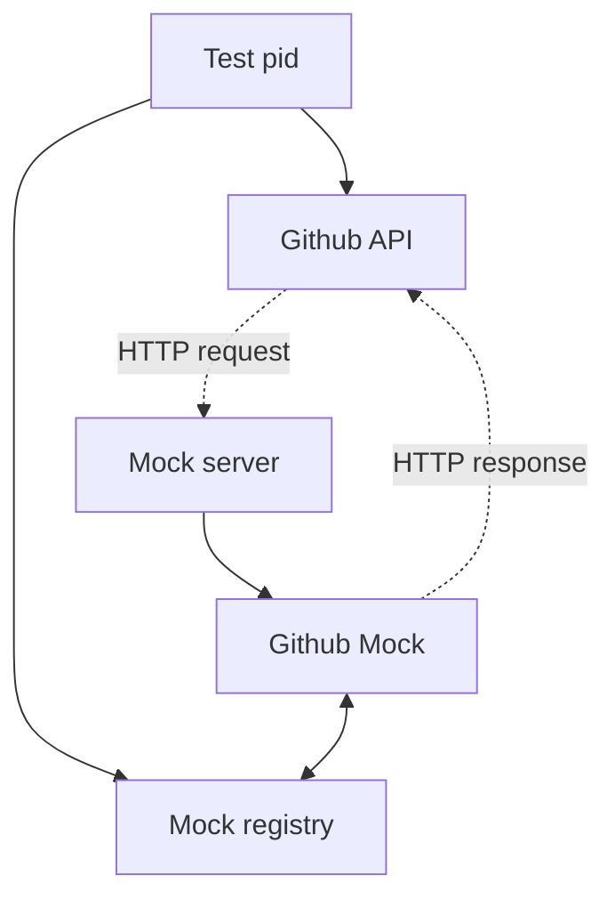

# Moxinet
Mocking server that, just like `mox`, allows parallel testing.

HexDocs: https://hexdocs.pm/moxinet

## Installation

Install the package by adding `moxinet` to your list of dependencies in `mix.exs`:

```elixir
def deps do
  [
    {:moxinet, "~> 0.4.0", only: :test}
  ]
end
```

### When using the `req` library, configure it to use `Moxinet.ReqTestAdapter` in yout `text.exs` file:

```elixir
# config/test.exs

config :req, default_options: [
  adapter: &Moxinet.ReqTestAdapter.run/1
]
```

## Getting started
To use `moxinet` you must first define your mock server, from which you'll forward
mock-specific requests:

```elixir
# test/support/mock_server.ex

defmodule MyApp.MockServer do
  use Moxinet.Server

  forward("/github", to: GithubMock)
end
```

Then create the mock module (in this example `GithubMock`):

```elixir
# test/support/mock_servers/github_mock.ex

defmodule GithubMock do
  use Moxinet.Mock
end
```

Start `moxinet` in your test helper (before `ExUnit.start()`)
```elixir
# test/test_helper.exs
{:ok, _} = Moxinet.start(port: 4040, router: MyApp.MockServer)

ExUnit.start()
```

Let the API configuration decide whether the API should call the remote server or the local mock server:

```elixir
# config/config.exs
config :my_app, GithubAPI,
  url: "https://api.github.com"

# config/test.exs
config :my_app, GithubAPI,
  url: "http://localhost:4040/github"
```

---

If you're familiar with `plug`, you'll see that our mock server is indeed a plug and can therefore
be extended like one.

After you've added your server, mocks can be defined:

```elixir
# test/support/mocks/github_mock.ex
defmodule GithubMock do
  use Moxinet.Mock
end
```

In tests, you can create rules for how your mocks should behave through `expect/4`:

```elixir
alias Moxinet.Response

describe "create_pr/1" do
  test "creates a pull request when" do
    GithubMock.expect(:post, "/pull-requests/123", fn _payload ->
      %Response{status: 202, body: %{id: "pull-request-id"}, headers: [{"X-Rate-Limit", 10}]}
    end)

    assert {:ok,
      %{
       status: 202,
       body: %{"id" => "pull-request-id"},
       headers: [
         {"X-Rate-Limit", 10},
         {"Content-Type", "application/json"}
       ]
      }
    } = GithubAPI.create_pr(title: "My PR")
  end
end
```

**NOTE for requests not managed by `req`**: One small caveat with `moxinet` is that in order for us to be able to match
a mock defined in a request with an incoming request, the requests must send the `x-moxinet-ref` header.
Most HTTP libraries allows adding custom headers to your requests, but that might not always be the case.

It's also not recommended to send the `x-moxinet-ref` header outside your test environment, meaning you'd
likely want to do find a way to conditionally add it. Here is one example on how to achieve it in `req`:

```elixir
defmodule GithubAPI do
  def client do
    Req.new([
      # ...
    ])
    |> add_moxinet_header()
  end

  defmacrop add_moxinet_header(req) do
    if Mix.env() == :test do
      quote do
        {header_name, header_value} = Moxinet.build_mock_header()
      
        Req.Request.put_new_header(unquote(req), header_name, header_value)
      end
    else
      quote do
        unquote(req)
      end
    end
  end
end
```

## Why not use `mox` instead?
When testing calls to external servers `mox` tends to guide the user towards
replacing the whole HTTP layer which is usually fine when the code is controlled
by an external library, holding the responsibility of correctness on its own.

A commonly seen pattern where behaviors play the centric role like the following:

```elixir
defmodule GithubAPI do
  defmodule HTTPBehaviour do
    @callback post(String.t(), Keyword.t()) :: {:ok, Map.t()} | {:error, :atom}
  end

  defmodule HTTP do
    @behaviour GithubAPI.HTTPBehaviour
    def post(url, opts) do
      # Perform HTTP request
    end
  end

  def create_pr(attrs) do
    impl().post("/pull-requests", body: attrs)
  end

  defp impl, do: Application.get_env(:github_api_http_module, HTTP)
end
```

will absolutely do the job, but there are a few drawbacks:

1. The `HTTP` remains untested as that is not being used by the test suite
2. HTTP client libraries (like tesla) usually allow defining headers, authentication,
   and in most cases also encodes passed data structures to JSON, where custom behavior
   that filters/encodes data in certain ways can be included. I've seen cases where a
   `@derive {Jason, only: [...]}` caused a bug that wasn't a bug according to all tests
   that verified the expected data was sent to the HTTP layer.

`moxinet` aims to fill those gaps while also reducing the need for behaviors and mocks


## How it works
`Moxinet` works a lot similar to `mox` except it'll focus on solving the same issue for HTTP request.

The test pid will be registered in the mock registry, where it can later be accessed from inside the mock.


