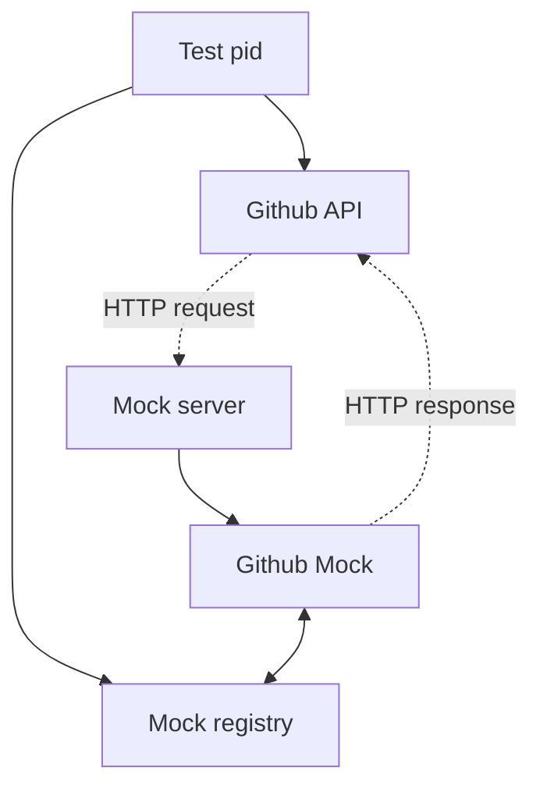

# Moxinet
Mocking server that, just like mox, allows parallel testing.

## Installation

If [available in Hex](https://hex.pm/docs/publish), the package can be installed
by adding `moxinet` to your list of dependencies in `mix.exs`:

```elixir
def deps do
  [
    {:moxinet, "~> 0.1.0"}
  ]
end
```

## Usage
To use moxinet you must first define your mock server, from which you'll forward
mock-specific requests:

```elixir
# test/support/mock_server.ex

defmodule MockServer do
  use Moxinet.Router

  forward("/github", to: GithubMock)
end
```

If you're familiar with `plug`, you'll see that our mock server is indeed a plug and can therefore
be extended like one.

After you've added your server, mocks can be defined:

```elixir
# test/support/mocks/github_mock.ex

defmodule GithubMock do
  use Moxinet.Mock
end
```


In tests, you can create rules for how your mocks should behave through `expect/3`:

```elixir
describe "create_pr/1" do
  test "creates a pull request when" do
    GithubMock.expect(:post, fn "/pull-requests/123", _payload ->
      %{status: 202, body: %{id: "pull-request-id"}}
    end)

    assert {:ok, %{status: 202, body: %{"id" => "pull-request-id"}}}} = GithubAPI.create_pr(title: "My PR")
  end
end
```

**NOTE**: One small caveat with moxinet is that in order for us to be able to match
a mock defined in a request with an incoming request, the requests must send the `x-moxinet-ref` header.
Most http-libraries allows adding custom headers to your requests but that might not always be the case.

It's also not recommended to send the `x-moxinet-ref` header outside of your test environment, meaning you'd
likely want to do find a way to conditionally add it. Here is one example on how to achieve it in `req`:

```elixir
defmodule GithubAPI do
  def client do
    Req.new([
      # ...
    ])
    |> add_moxinet_header()
  end

  defmacrop add_moxinet_header(req) do
    if Mix.env() == :test do
      quote do
        {header_name, header_value} = Moxinet.build_mock_header()
      
        Req.Request.put_new_header(unquote(req), header_name, header_value)
      end
    else
      quote do
        unquote(req)
      end
    end
  end
end
```

## How it works
Moxinet works a lot similar to `mox` except it'll focus on solving the same issue for HTTP request.

The test pid will be registered in the mock registry, where it can later be accessed from inside the mock.




Documentation can be generated with [ExDoc](https://github.com/elixir-lang/ex_doc)
and published on [HexDocs](https://hexdocs.pm). Once published, the docs can
be found at <https://hexdocs.pm/moxinet>.

