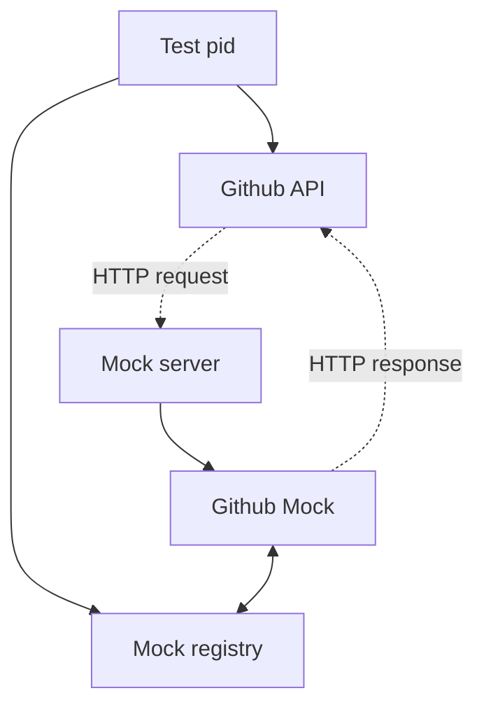

# Moxinet

HTTP mocking server for Elixir that supports parallel testing — like `mox`, but at the HTTP layer.

HexDocs: https://hexdocs.pm/moxinet

## Installation

Add `moxinet` to your list of dependencies in `mix.exs`:

```elixir
def deps do
  [
    {:moxinet, "~> 0.7.0", only: :test}
  ]
end
```

## Getting started

### 1. Define a mock server

The mock server is a Plug router that forwards requests to mock modules:

```elixir
# test/support/mock_server.ex

defmodule MyApp.MockServer do
  use Moxinet.Server

  forward("/github", to: GithubMock)
end
```

### 2. Create a mock module

```elixir
# test/support/mock_servers/github_mock.ex

defmodule GithubMock do
  use Moxinet.Mock
end
```

### 3. Start Moxinet in your test helper

Moxinet must be started before `ExUnit.start()`:

```elixir
# test/test_helper.exs
{:ok, _} = Moxinet.start(port: 4040, router: MyApp.MockServer)

ExUnit.start()
```

### 4. Configure your API urls

Point API urls at the mock server in the test environment:

```elixir
# config/config.exs
config :my_app, GithubAPI,
  url: "https://api.github.com"

# config/test.exs
config :my_app, GithubAPI,
  url: "http://localhost:4040/github"
```

### 5. Configure the `req` adapter (recommended)

With `req`, configure the adapter in `test.exs`. This automatically injects the `x-moxinet-ref` header into all requests — no manual header management needed:

```elixir
# config/test.exs
config :req, default_options: [
  adapter: &Moxinet.Adapters.ReqTestAdapter.run/1
]
```

### 6. Write tests

Use `expect/4` to define how your mocks should respond:

```elixir
alias Moxinet.Response

describe "create_pr/1" do
  test "creates a pull request" do
    GithubMock.expect(:post, "/pull-requests/123", fn _payload ->
      %Response{status: 202, body: %{id: "pull-request-id"}, headers: [{"X-Rate-Limit", 10}]}
    end)

    assert {:ok,
      %{
       status: 202,
       body: %{"id" => "pull-request-id"},
       headers: [
         {"X-Rate-Limit", 10},
         {"Content-Type", "application/json"}
       ]
      }
    } = GithubAPI.create_pr(title: "My PR")
  end
end
```

## Core concepts

### `Moxinet.Response`

Every `expect` callback must return a `%Moxinet.Response{}` struct:

```elixir
%Moxinet.Response{
  status: 200,                          # required, integer 100-600
  body: %{key: "value"},                # map, list, or binary (maps/lists are JSON-encoded)
  headers: [{"X-Rate-Limit", "100"}]    # optional response headers
}
```

The `Content-Type: application/json` header is added automatically when the body is a map or list.

### `expect/4` options

Pass options as the fifth argument:

- `times:` — how many times the expectation can be matched (default: `1`)
- `pid:` — the owning pid (default: `self()`)

```elixir
GithubMock.expect(:get, "/events", fn _body ->
  %Moxinet.Response{status: 200, body: []}
end, times: 3)
```

Callbacks can be 1-arity (receives the request body) or 2-arity (receives the request body and headers).

### `allow/2`

`$callers` propagation covers `Task` and most OTP processes automatically. For plain `spawn/1`, explicitly grant access:

```elixir
test "spawned process uses parent mocks" do
  parent = self()

  GithubMock.expect(:get, "/users", fn _ ->
    %Moxinet.Response{status: 200, body: []}
  end)

  spawn(fn ->
    Moxinet.allow(parent, self())
    MyHTTPClient.get("/users")
  end)
end
```

### `verify_usage!`

Unused expectations raise `Moxinet.UnusedExpectationsError` at the end of each test. This is checked automatically via an `on_exit` callback registered by `expect/4`.

To verify explicitly:

```elixir
setup :verify_usage!
```

### Error reference

| Error | Cause |
|---|---|
| `Moxinet.MissingMockError` | No expectation registered for that pid/method/path |
| `Moxinet.ExceededUsageLimitError` | Expectation called more times than its `times:` limit |
| `Moxinet.InvalidReferenceError` | `x-moxinet-ref` header contained an unrecognised value |
| `Moxinet.UnusedExpectationsError` | Test ended with expectations that were never called |

## Using non-`req` HTTP clients

Without `req`, the `x-moxinet-ref` header must be added manually. Without it, Moxinet cannot match incoming requests to test processes.

Use `Moxinet.build_mock_header/0` to get the header tuple. Only include it in the test environment:

```elixir
defmodule GithubAPI do
  def client do
    Req.new([
      # ...
    ])
    |> add_moxinet_header()
  end

  defmacrop add_moxinet_header(req) do
    if Mix.env() == :test do
      quote do
        {header_name, header_value} = Moxinet.build_mock_header()
      
        Req.Request.put_new_header(unquote(req), header_name, header_value)
      end
    else
      quote do
        unquote(req)
      end
    end
  end
end
```

## Static fallbacks and plug composition

Mock modules are Plugs — extend them like any other.

Define static routes alongside dynamic expectations. Static routes match after dynamic expectations, so use them for responses that never vary across tests:

```elixir
defmodule GithubMock do
  use Moxinet.Mock

  get "/pull-requests/closed" do
    send_resp(conn, 200, Jason.encode!([%{id: "1", closed: true}]))
  end
end
```

Compose with other plugs for shared verification logic:

```elixir
defmodule GithubMock do
  use Moxinet.Mock

  import Plug.BasicAuth
  plug :basic_auth, username: "user", password: "s3cr3t"
end
```

## Why not `mox`?

When testing external HTTP calls, `mox` guides you towards replacing the entire HTTP layer. A common pattern:

```elixir
defmodule GithubAPI do
  defmodule HTTPBehaviour do
    @callback post(String.t(), Keyword.t()) :: {:ok, Map.t()} | {:error, :atom}
  end

  defmodule HTTP do
    @behaviour GithubAPI.HTTPBehaviour
    def post(url, opts) do
      # Perform HTTP request
    end
  end

  def create_pr(attrs) do
    impl().post("/pull-requests", body: attrs)
  end

  defp impl, do: Application.get_env(:github_api_http_module, HTTP)
end
```

This works, but has drawbacks:

1. The `HTTP` module remains untested — the test suite never exercises it
2. HTTP client libraries (like Tesla) handle headers, authentication, and JSON encoding. Custom encoding logic can hide bugs — a `@derive {Jason, only: [...]}` can cause a production bug that all tests miss because they verify data sent to the HTTP layer, not the wire

Moxinet fills those gaps while reducing the need for behaviours and mocks.

## How it works

Moxinet works like `mox`, but for HTTP requests.

The test pid is registered in the mock registry. When a request arrives, the mock looks up the pid to find the matching expectation.


```mermaid
flowchart TD
    TP[Test pid] --> MR[Mock registry]
    GMS <--> MR
    TP --> API[Github API]
    API -.HTTP request.-> MS[Mock server]
    MS --> GMS[Github Mock]
    GMS -.HTTP response.-> API
```
